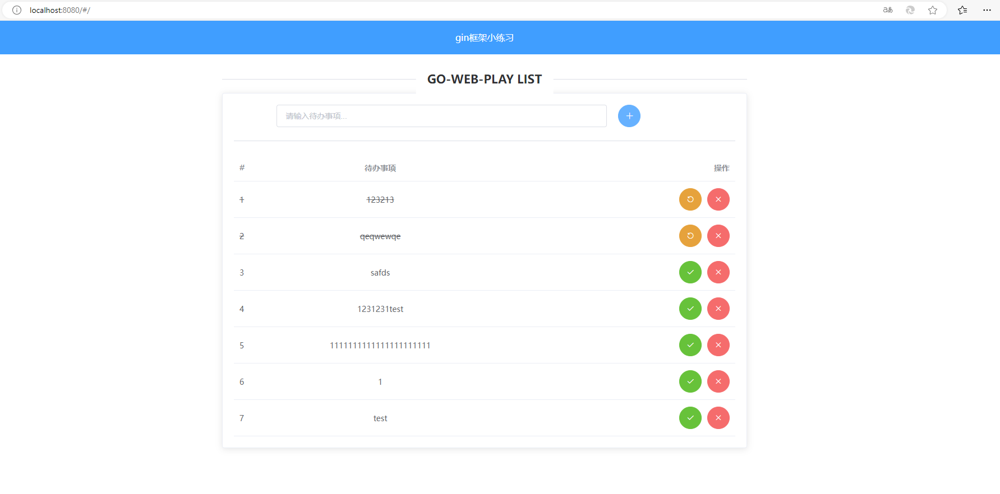

# GO-WEB-PLAY-LIST

参考学习内容如下：

[1.刘丹冰老师的8小时转职Golang工程师](https://www.bilibili.com/video/BV1gf4y1r79E/?spm_id_from=333.337.search-card.all.click&vd_source=bbb985ceadc8e3199d1d5a091b58155b)

[2.基于gin框架和gorm的web开发实战](https://www.bilibili.com/video/BV1gJ411p7xC/?spm_id_from=333.788.recommend_more_video.2&vd_source=bbb985ceadc8e3199d1d5a091b58155b)

[3.JACK老师 goland视频课 if you have access](https://meeting.tencent.com/cw/xxxxxx)


一个基于go基础语法 + gin + gorm 开发的练手小项目，通过该项目可初识go web开发该有的姿势。

前端页面基于vue和ElementUI开发，对前端不熟悉的童鞋可直接下载`templates`和`static`文件夹下的内容使用。




## 使用指南
### 下载
```bash
git clone https://github.com/ailin-licslin/go-web-play.git
```
### 配置MySQL
1. 在你的数据库中执行以下命令，创建本项目所用的数据库：
```sql
CREATE DATABASE db1 DEFAULT CHARSET=utf8mb4;
```
2. 在`go-web-play/conf/config.ini`文件中按如下提示配置数据库连接信息。

```ini
port = 8080
release = false

[mysql]
user = 你的数据库用户名
password = 你的数据库密码
host = 你的数据库host地址
port = 你的数据库端口
db = db1
```

### 编译
```bash
go build
```

### 执行

Mac/Unix：
```bash
./go-web-play.exe conf/config.ini
```
Windows:
```bash
go-web-play.exe conf/config.ini
```

启动之后，使用浏览器打开`http://127.0.0.1:8080/`即可。


3. 文件分层(a go base)  GOLANG BASE STUDY  
```
├── 1-firstGolang         Let's get strated!
│   └── hello.go
├── 2-var                 变量定义
│   └── test1_var.go
├── 3-const_iota          常量
│   └── test2_const.gp
├── 4-function            方法
│   └── test3_function.go
├── 5-init  
│   └── xx.go
├── 6-pointer             指针
│   └── pointer.go
├── 7-defer             
│   └── defer.go
├── 8-slice               切片
│   └── pointer.go
├── 9-map                 集合
│   └── test_map1.go
│   └── test_map2.go
├── 10-oop             
│   └── xx.go
├── 11-reflect            反射
│   └── xx.go
├── 12-goroutine           
│   └── pointer.go
├── 13-channel             
│   └── xx.go
├── 14-goland-IM-system   应用
│   └── xx.go
├── 15-select   多路复用
│   └── xx.go
```


4. 文件分层  BASE LEARN GIN
```
├── README.md
├── goroutine           
│   └── main.go
├── middleware      中间件
│   └── cors.go
|   └── cost-time.go
|   └── ginBodyLogMiddleware.go
├── orm             
│   └── mian.go
├── docs            
├── query          输入输出结构层
│   └── 不同获取参数方式
├── go.mod
├── go.sum
├── main.go         入口文件
└── upload          文件上传处理
    └── upload.xx
```

5. 文件分层  web GIN & GORM USAGE
```
├── README.md
├── conf            配置文件夹
│   └── config.ini
├── controller      控制器
│   └── controller.go
├── dao             DB数据层
│   └── mysql.go
├── models          输入输出结构层
│   └── todo.go
├── setting        配置文件信息
│   └── setting.go
├── go.mod
├── go.sum
├── main.go         入口文件
├── static      静态文件
│   ├── css
│   ├── fonts
│   ├── js
├── templates          模板
│   ├── log.go
│   ├── mysql.go
│   └── validate.go
└── routers          路由层
    └── routers.go
```

6 Web3.0 back end exercise 考虑后续单独拿出来
```
├── task1          
│   ├── Leetcode 21
│   ├── Leetcode 26
│   └── ...
│   └── Leetcode 729
├── task2          
│   ├── goroutin.go
│   ├── main.go
│   └── pointer.go
├── task3          
│   ├── Gorm1-3
│   ├── sql1-2
│   └── transaction & CRUD
├── task4          
│   ├── GO-BLOG (https://github.com/ailin-licslan/go-blog-build)
├── task5          
│   ├── 5.1-5.7 (WEB3行业了解)
├── task6          
│   ├── ERC20   (SOLIDITY)
│   ├── ERC721  (SOLIDITY)
│   └── BEGGING (SOLIDITY)
```

